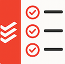

# Todoist Custom Sidebar

A Chrome extension (Manifest V3) that puts your [Todoist](https://todoist.com) tasks in a slide-out sidebar on any webpage — view, add, complete, and edit tasks without leaving the page you're on.

## Features

- **Views**: 📥 Inbox, 📅 Today (including overdue), all tasks, or any single project
- **Quick add** with Todoist syntax — `#project`, `@label`, and natural-language dates like `tomorrow`, highlighted as you type
- **Add current page** — one click captures the tab's title and URL as a task
- **Group by label**, with collapsible groups and a focus mode (click a group header)
- **Inline actions** — complete with the checkbox, cycle priority with the colored dot, click a task to edit everything else
- **Label manager** — rename and recolor your Todoist labels
- Light/dark theme follows your system setting

## Install

1. Download or clone this repository
2. Open `chrome://extensions` in Chrome
3. Enable **Developer mode** (top right)
4. Click **Load unpacked** and select this folder

## Setup

1. Click the extension's toolbar icon on any regular webpage — the sidebar slides open
   (it can't run on browser pages like `chrome://…` or the Chrome Web Store; the icon shows a `!` badge if you try)
2. Grab your personal API token from Todoist: **Settings → Integrations → Developer**, or go straight to [your token page](https://app.todoist.com/app/settings/integrations/developer)
3. Paste it into the sidebar and hit **Connect**

To switch accounts later, click the key icon in the sidebar header.

## Privacy

Your API token is stored locally in your browser (`chrome.storage.local`) and is only ever sent to `api.todoist.com`. No data is collected by the developer. Full details in [PRIVACY.md](PRIVACY.md).
